# Agenda

- Introduction

- Data

- Methods

- Results and Findings

- Conclusion

# Introduction

##

> The Question: Is there some sort of seasonality in the types of crimes over 10 years in Berkeley? Does the mix of crime types shift with the seasons?

If crime shifts seasonally, police can deploy resources according to which crime type might be most prolific, rather than treating each month the same.

## Policy and Prevention

Understanding seasonality lets city officials and community organizations time interventions. If certain crimes spike in summer (like theft or assault), prevention programs, outreach, or lighting improvements can be deployed before the peak, not after.

> This project brings together a testable question to decisions that affect residents' safety and city budgets.

# Data

## Dataset {.smaller}

The dataset I will use is the [Berkeley Police Department’s Cases](https://bpd-transparency-initiative-berkeleypd.hub.arcgis.com/datasets/4f77ec668f354c24aeabc101cfc23e35_0/explore) from 2016 to current, in which each row is a police-reported case, and the columns are that case’s:

- ID number

- the time and date at which it occurred

- the incident type

- statute

- statute description

- block address

- city

- ZIP code

## Dataset {.smaller}

```{python}
import pandas as pd
bpd = pd.read_csv("data/bpd-2016-now.csv")
bpd.head()
```

## Data Cleaning {.smaller}

I selected the `Case_Number`, `Occurred_Datetime`, and `Incident_Type` columns. These columns are the only ones that are relevant for my analysis.

```{python}
bpd = bpd[["Case_Number", "Occurred_Datetime", "Incident_Type"]]
bpd.head()
```

## Data Cleaning {.smaller}

In `Incident_Type`, there are the following entries:

```{python}
print(bpd["Incident_Type"].unique())
print(bpd["Incident_Type"].nunique())
```

The 8 incident types I will identify seasonality for are: Theft Misdemeanor (Under $950), Burglary Auto, Vehicle Stolen, Disturbance, Theft Felony (over $950), Vandalism, Burglary Residential, and Assault/Battery Misdemeanor. These categories have the most occurences and therefore are best suited for identifying frequencies.


```{python}
# parse date time column
bpd["Occurred_Datetime"] = pd.to_datetime(bpd["Occurred_Datetime"])
bpd["Month"] = bpd["Occurred_Datetime"].dt.month
bpd["Year"] = bpd["Occurred_Datetime"].dt.year

# add season column
def get_season(month):
    if month in [12, 1, 2]:
        return "Winter"
    elif month in [3, 4, 5]:
        return "Spring"
    elif month in [6, 7, 8]:
        return "Summer"
    else:
        return "Fall"

bpd["Season"] = bpd["Month"].apply(get_season)
```


```{python}
# Prep to aggregate to weekly counts per crime type
bpd["Week"] = bpd["Occurred_Datetime"].dt.to_period("W")
bpd.head()

# focus on the major categories
major_crimes = ["Theft Misdemeanor (Under $950)", "Burglary Auto", "Vehicle Stolen", "Disturbance", "Theft Felony (over $950)", "Vandalism", "Burglary Residential", "Assault/Battery Misdemeanor"]

# Remove duplicates introduced by dropping the specific Statute_Description column
bpd_clean = bpd.drop_duplicates(subset="Case_Number")

# Filtering to rows matching major categories
bpd_filtered = bpd_clean[bpd_clean["Incident_Type"].isin(major_crimes)]
```

## Data Cleaning {.smaller}

I prepared the data to aggregate events to weekly counts per crime type, and then filtered just the major `Incident_Type` categories I am interested in for my analysis through a join.

This results in my final dataset which I will use for my analyses in the next steps.

```{python}
# Weekly counts per crime type
weekly = (
    bpd_filtered
    .groupby(["Week", "Incident_Type"])
    .size()
    .reset_index(name="Count")
    .pivot(index="Week", columns="Incident_Type", values="Count")
    .fillna(0)
    .sort_index()
)

weekly.head()
```

# Methods

I used:

-   Power Spectral Density Analysis

-   Short-Time Fourier Transforms

-   Time Lagged Regression

## Power Spectral Density {.smaller}

I conducted a Power Spectral Density analysis using Welch's method. Welch smooths the raw periodigram by averaging the overlapping segments, which reduces noise so peaks are easier to interpret when they occur.

This helped me identify if periodic signals exist in the data.

## Short-Time Fourier Transforms by Crime Type {.smaller}

I applied a short-time Fourier Transform over the 10 year chunk of data to find whether the seasonal pattern strengthens or weakens over the years, which is particularly interesting to ask after the 2020 pandemic.

## Time Lagged Regression {.smaller}

Lastly, I conducted time lagged regression to understand how much seeing previous data helps us predict future crime.

# Results and Findings

## Power Spectral Density

::::: columns
::: column
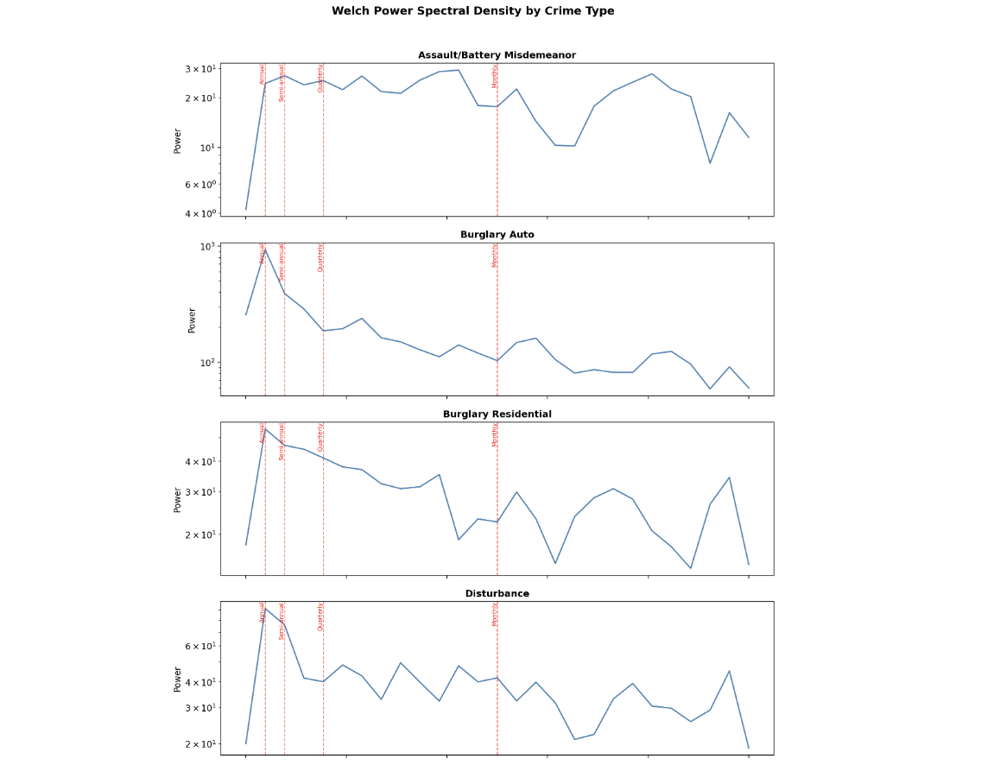{height="550px"}
:::

::: column
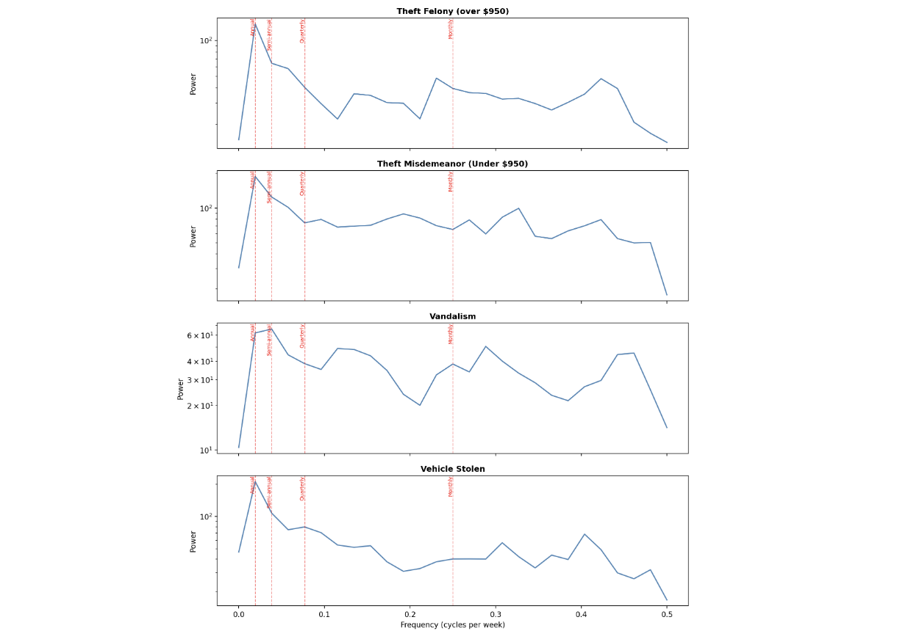{height="550px"}
:::
:::::

## Power Spectral Density Findings {.smaller}

| Crime Type | Strongest Periodicity | 2nd Strongest Periodicity |
|--------------------------|----------------------|-------------------------|
| *Residential Burglaries* | annual | semi-annual |
| *Vehicle Stolen* | monthly | annual |
| *Theft Misdimeanor* | annual | semi-annual |
| *Burglary Auto* | quarterly | annual |
| *Theft Felony* | semi-annual | quarterly |
| *Disturbance* | monthly | semi-annual |
| *Vandalism* | annual | semi-annual |
| *Assault/Battery Misdemeanor* | annual | semi-annual |

## Short Time Fourier Transforms {.smaller}

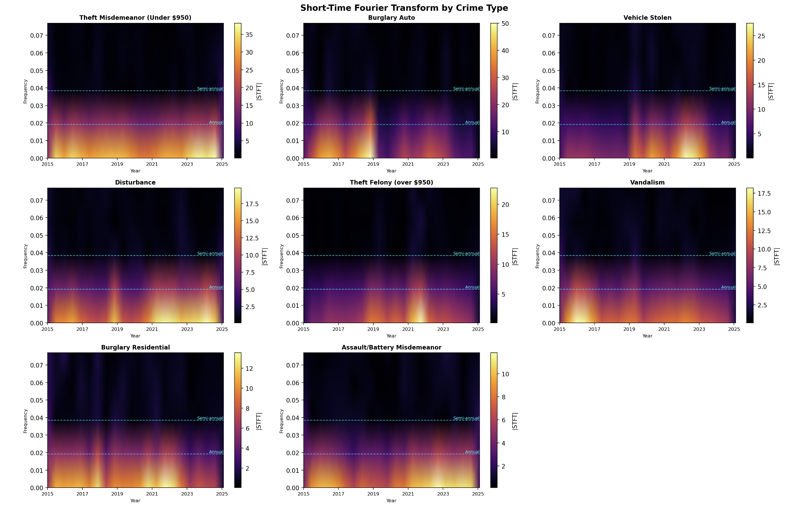

## Short Time Fourier Transforms {.smaller}

I have added dotted lines at the frequencies for annual and semi-annual trends to make it immediately obvious whether a bright band aligns with a meaningful cycle.

Many categories show a decrease in crime in recent years, especially Burglary Auto, Theft Felony, Vandalism, and Burglary Residential.

## STFT: Theft Misdemeanor {.smaller}

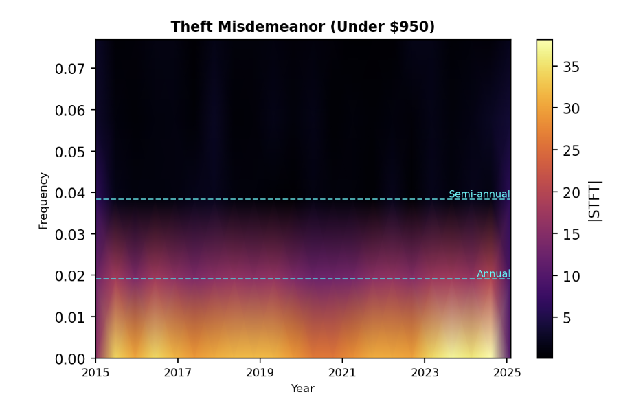

-  bright annual signal, consistent throughout

- strong signal at the annual line

## STFT: Burglary Auto {.smaller}

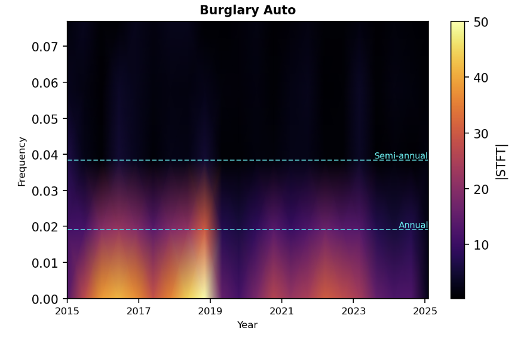

-  has some flares that are bright in the semi-annual band, but mostly bright in the annual area

- very bright 2016-2019, with a marked decrease during COVID years, and a smaller resurgence in 2021-2023

## STFT: Vehicle Stolen {.smaller}

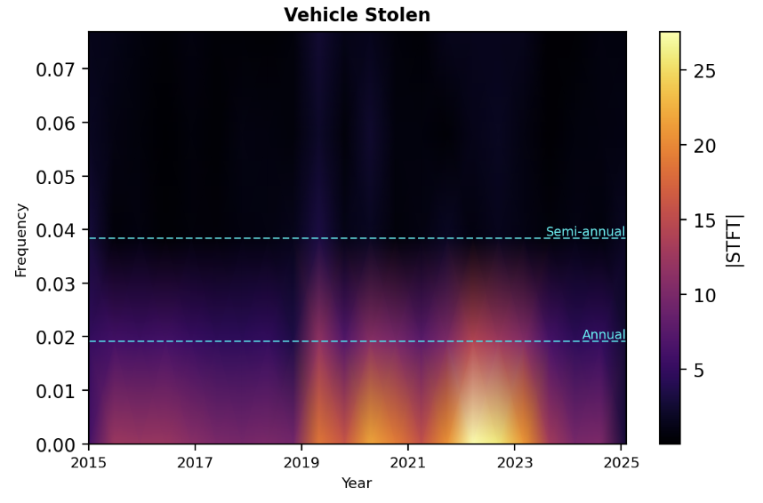

-  clear signals at annual line, especially 2019-2025, which brightens after the pandemic

## STFT: Disturbance {.smaller}

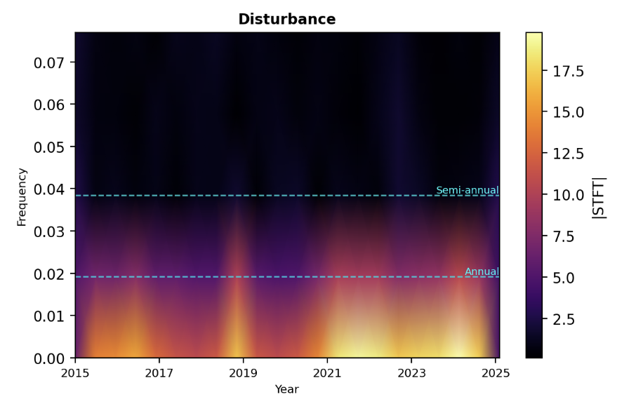

-  energy is spread across low frequencies rather than concentrated at annual or semi-annual, suggesting slow trends rather than sharp seasonal cycles

## STFT: Theft Felony {.smaller}

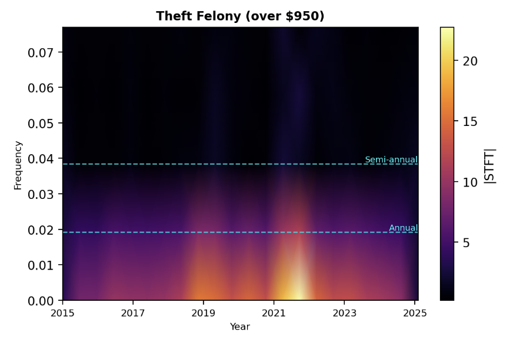

-  shows some annual periodicity but its not as consistent of a horizontal band like for Theft Misdimeanor. Much brighter after the pandemic years

## STFT: Vandalism {.smaller}

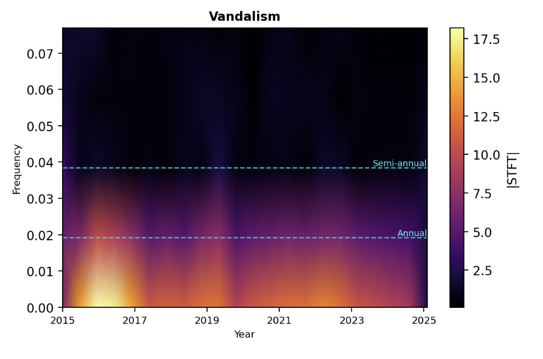

-   similar to disturbance, diffused low-frequency energy

- Shows some frequencies at the annual line

## STFT: Burglary Residential {.smaller}

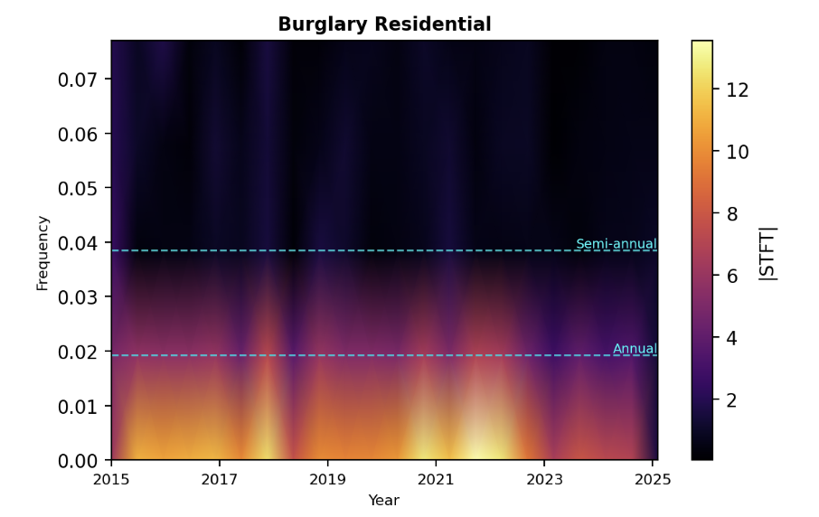

-  bright band right at the annual frequency, persisting until 2023 and then decreasing in brightness


## STFT: Assault/Battery Misdemeanor {.smaller}

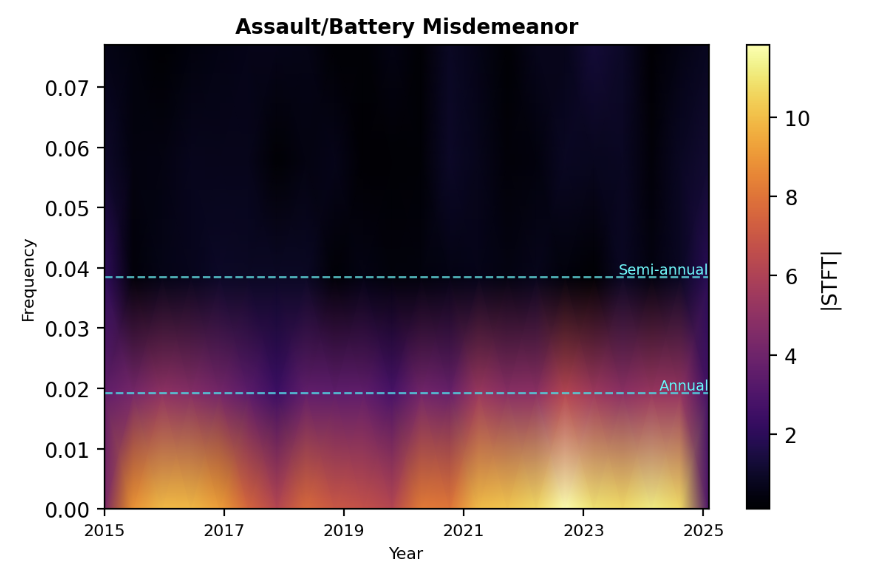

-   relatively dim overall but some annual structure visible

## Time Lagged Regression Findings {.smaller}

- I used **Negative Binomial regression** instead of OLS to better handle the non-normal/overdispersed count structure of weekly crime data

- **Burglary Residential** lag52 and lag51 are both significant (LLR p = 0.0006), confirmed by the lowest overdispersion (α = 0.08) of any crime type, which indicates a stable, predictable yearly cycle

- **Vehicle Stolen** and **Theft Misdemeanor** show some annual structure, where the neighboring lags are significant but not lag52 itself, which suggests an existing but imprecise annual pattern that drifts slightly from year to year.

## Time Lagged Regression Findings {.smaller}

- **Burglary Auto, Theft Felony, Disturbance, and Vandalism** show no significant annual lag structure, but all have very significant semi-annual lags (lag25/26/27), which confirms that their dominant seasonal cycle repeats about every 6 months rather than every year

- **Assault/Battery Misdemeanor** is the only crime type with evidence of both annual and semi-annual periodicity, suggesting a seasonal structure that is more complex

## Results by Crime Type {.smaller}

| Crime Type            | Dominant Cycle | TLR Significant    | Peak Season  |
|-----------------------|----------------|--------------------|--------------|
| Burglary Residential  | Annual         | Yes (lag52, lag51) | Winter       |
| Vehicle Stolen        | Annual         | Partial (lag51)    | Summer       |
| Theft Misdemeanor     | Annual         | Partial (lag53)    | Summer       |
| Burglary Auto         | Semi-annual    | Yes (all lag26)    | Winter       |
| Theft Felony          | Semi-annual    | Yes (lag26, lag25) | Fall, Winter |
| Disturbance           | Semi-annual    | Yes (all lag26)    | Spring, Fall |
| Vandalism             | Semi-annual    | Yes (all lag26)    | Winter       |
| Assault/Battery Misd. | Both           | Yes (both)         | Spring, Fall |

# Conclusion

## Conclusion {.smaller}

- Seasonal structure in BPD data exists; crimes are not randomly distributed over time

- Three crimes show annual periodicity (Burglary Residential, Vehicle Stolen, and Theft Misdemeanor), with counts that repeat on a roughly year-over-year cycle

- Four crimes (Burglary Auto, Theft Felony, Disturbance, and Vandalism) show semi-annual periodicity, peaking roughly twice per year rather than once

- Assault/Battery Misdemeanor is unique in showing evidence of both annual and semi-annual structure at the same time

## Conclusion {.smaller}

- From the STFT, I can see that most crime signals weakened sharply during COVID-19 (2020–2021), with some categories recovering afterward and others not

- Burglary Auto in particular was markedly elevated pre-pandemic and never fully rebounded

## Conclusion {.smaller}

> When crime happens in Berkeley is predictable by seasons.

- Theft Misdemeanor is the most stable signal and the most predictable, closely followed by Assault/Battery Misdemeanor and Disturbance

- This has some practical implications for how police patrols are scheduled and how resources are allocated, raising more questions about what environmental or social factors drive these recurring seasonal rhythms

## Limitations {.smaller}

- No UCPD Data: Becacuse UCPD and BPD having separate jurisdictions, this dataset excludes any information about crime in and around the UC Berkeley campus

- Category aggregation: The 40 incident types in the raw data were narrowed to 8 because the others did not have enough counts, so seasonal patterns in rarer crimes (homicide, child abuse, gun/weapon offenses) were not examined

- No covariates: The models don't control for population changes, policing policy shifts, or socioeconomic factors that could independently drive seasonal patterns


## With more time... {.smaller}

- Incorporate covariates: Bring in weather data, UC Berkeley academic calendar, or local event data to test whether known external drivers explain the seasonal peaks

- Rare crime categories: With more data or Bayesian methods, revisit lower-frequency crime types that were excluded due to small sample sizes


# Thank you!